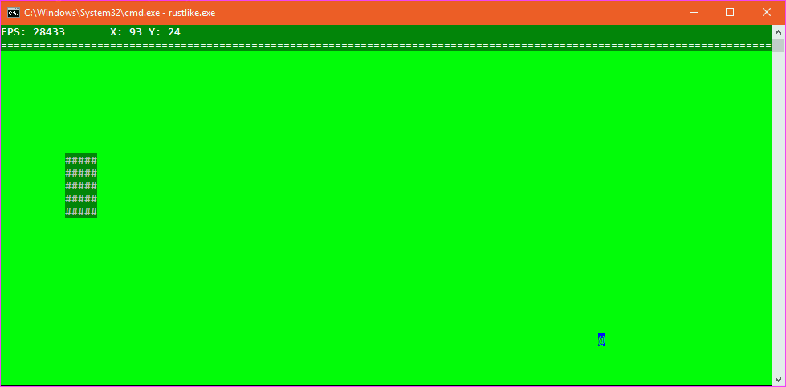

# rustlike
A roguelike engine in rust.

At least for now the terminal is being implemented for windows using winapi to increase the
draw speed. Writing directly to the console is much much faster than using the std out rust
provides.

The idea is to made a simple but powerful api to treat the console output as buffers, and
construct over the drawing engine a app and games simple frameworks. It should allow to make
simple UIs and games with it.

